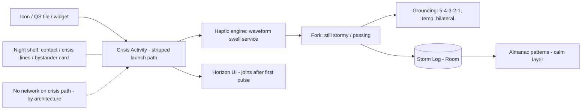

# Sway — help that arrives in two seconds

A panic attack is a five-alarm fire in a body that has forgotten how to breathe. In that moment, every design decision most apps make — splash screens, logins, mood check-ins, "what would you like to do today?" — is a locked door. Sway is built for exactly one moment: the bad one. Tap the icon and within two seconds the phone is pulsing a slow breathing rhythm against your palm. No account. No network. No menu. You can follow it with the phone in your pocket, eyes closed, on a train, in a meeting, in the dark. When the storm passes, Sway offers a hand off the floor: grounding exercises, a gentle log, patterns over time. It is a fire extinguisher, and it is designed with the seriousness fire extinguishers deserve.

## 1. Overview
- **Elevator pitch:** Panic-attack first aid: cold launch straight into haptic-led paced breathing (followable without looking), then grounding tools (5-4-3-2-1, temperature shift, bilateral stimulation), a one-tap "storm log," and month-scale pattern insights. 100% offline, no account, ever. Positioned carefully as a wellness tool with crisis-line signposting, not a medical treatment.
- **Category:** Health & Fitness — mental wellness.
- **Tagline:** *Help that arrives in two seconds.*
- **Play Store positioning:** "When panic hits, there's no time for menus. One tap. Breathe with your phone."

## 2. Problem & Why Now
Roughly 2–4% of people experience panic disorder, and far more have occasional panic attacks — yet the apps ostensibly serving them are meditation platforms (Calm, Headspace) whose crisis paths are buried three taps deep behind subscription walls and content libraries, or CBT companions designed for the calm hours, not the burning ones. The moment of panic has brutal UX requirements no mainstream app meets: instant availability (attacks don't wait for splash screens), zero cognitive load (working memory is gone), social invisibility (half of attacks happen in public — staring at a breathing circle on a train is its own stressor), and guaranteed function (network dependence fails in subway cars and airplane rows, two classic trigger sites). Why now: Android haptics matured (amplitude control on mid-range devices) making pocket-followable rhythm real; the mental-health app market's subscription-fatigue backlash creates an opening for a trustworthy one-price tool; and post-pandemic anxiety prevalence remains measurably elevated while therapy waitlists stretch months — first-aid-tier tools are the layer the system is missing.

## 3. Target Audience & Personas
- **Leah, 26, PhD student, Boston.** Panic attacks since undergrad, mostly on transit and before presentations. Has Calm (uses it to sleep). Needs the pocket mode desperately — her worst attacks are public. Finds Sway via an r/Anxiety thread; the phrase "no account, works in airplane mode" is what makes her install it.
- **Raj, 41, sales director, Mumbai.** Two attacks ever, both terrifying, one in a client meeting. He isn't "an anxiety person" (his words) and would never subscribe to a mental-health platform. A one-time ₹349 purchase after the app helped him once at 2am is a transaction he can make without a new identity.
- **Carmen, 55, teacher, Valencia, mother of a 19-year-old with panic disorder.** Installs it for her daughter, then for herself. The trusted-contact quick-dial and the "how to help someone having a panic attack" companion card make her the family's calm center.

## 4. Core Concept Deep-Dive
**The two-second covenant.** Sway's engineering north star is cold-launch-to-first-haptic-pulse in under 2 seconds on a mid-range device. Everything is architected backwards from that number: no splash, no network calls on the critical path, the breathing engine pre-warmed from a stripped launch activity, first pulse fired before the UI finishes composing. The icon on the home screen is, functionally, the button on a defibrillator.

**Haptic-led breathing is the invention.** Visual breathing guides own the market; Sway's rhythm lives in the body's channel instead. The pattern language: a swelling vibration ramp for inhale (amplitude rising like a wave gathering — you breathe *with* the swell), stillness for hold, a long fading pulse-train for exhale. Default protocol is physiological-sigh-informed and exhale-weighted (4s in, 6s out, no hold to start — breath-holds can spike panic in hyperventilation states), easing over three minutes toward 4-7-8 as the user steadies. The rhythm slows *adaptively but conservatively*: sessions begin faster (meeting a racing breather where they are — entrainment, the paced-breathing principle) and decelerate on a fixed gentle curve. In pocket mode the screen can be off entirely; the session runs on haptics alone, with an optional near-silent audio underlay (a low tide-like swell) for devices with weak motors.

**The screen, when you do look,** shows one thing: a horizon line that rises and falls like slow water. No circles to stare into, no countdown numbers, no text during the first minute. High contrast, huge motion, readable through tears — literally a design requirement: blurred-vision legibility tested with frosted lenses.

**After the wave — the offboarding is the product's second half.** When the session ends (user-ended or after a default 6 minutes), Sway never dumps you back to a menu. It asks one thing: "Still stormy, or passing?" *Still stormy* → continues into grounding: 5-4-3-2-1 senses walkthrough (spoken option, slow, one sense per screen), temperature-shift guidance ("cold water on wrists; hold something cold" — the diving-reflex trick, framed as folk-practical, not clinical), or bilateral tapping (alternating left/right haptic taps, hands on chest — a self-soothing pattern users of EMDR-adjacent techniques will recognize, presented without clinical claims). *Passing* → the Storm Log: one screen, two taps — intensity (a simple 1–5 wave size) and optional context chips (home/transit/work/night/social/unknown) — then a genuinely warm closing card ("That was hard. You rode it.") and done. Logging is always skippable; the log exists for the user's own patterns, never for streaks.

**Patterns, gently.** The Almanac view shows storms over months: frequency, time-of-day clusters, context patterns ("7 of 9 storms began on transit"), and — the quietly hopeful metric — average ride-out duration trending down. Framing is meteorological throughout: storms, not failures; patterns, not symptoms. The app never diagnoses, never scores anxiety, never gamifies ("3-day storm-free streak!" would be an abomination — a bad day would break both the streak and the user's trust).

**The night shelf & companion card.** A configurable quick-actions row: call trusted contact (one tap to a pre-chosen person), local crisis line (region-aware numbers, offline-cached), and "hand this to someone" — a full-screen card for a bystander: "I'm having a panic attack. It will pass. Please stay with me. Don't ask questions yet. If I don't improve in 20 minutes, help me call ___." That card has made strangers into helpers; it is the feature users tell stories about.

## 5. Complete Feature Set
**MVP (v1.0):**
- Instant breathing session: haptic-led, exhale-weighted adaptive pacing, pocket mode, horizon visual, optional audio underlay; 2-second covenant enforced.
- Grounding suite: 5-4-3-2-1 (text + spoken), temperature-shift guide, bilateral tapping mode.
- Storm Log (2-tap) + Almanac patterns view; plain-text export.
- Night shelf: trusted contact quick-dial, offline-cached regional crisis lines (ITU country list, maintained), bystander companion card (localized).
- Quick Settings tile + home-screen widget + long-press icon shortcut (three extra ignition paths); works fully in airplane mode; no account, no analytics on the crisis path.
- Haptic calibration wizard (motors vary wildly; 90 seconds, once).
**v1.x fast-follows:**
- Wear OS companion (wrist haptics are even more discreet; session starts from watch).
- Practice mode: 3-minute daily calm-hours rehearsal (skill-building framed as "learning the rhythm while the sea is calm"), with its own reminder fully separated from crisis features.
- Additional protocols (box breathing, 4-7-8 direct) selectable in settings — defaults stay opinionated.
- More languages for spoken grounding (launch: EN, ES, HI, DE, FR).
**v2.0+:**
- "First-aid kit" customization: reorder/remove tools so a user's personal sequence is one flow.
- Clinician-shareable Almanac PDF (user-initiated export for their own therapist — data leaves only by the user's hand).
- Optional secure backup (E2E, passphrase) for log continuity across devices.

## 6. Screen-by-Screen UX Walkthrough
Navigation: two-layer app. Layer 1 (crisis) is a single screen with zero navigation. Layer 2 (calm hours) is three tabs — **Shelter** (home/config), **Almanac**, **Learn** — reachable only via a deliberate "not in crisis" entrance.
- **Ignition:** app icon / QS tile / widget → **Session screen** immediately: horizon line already moving, first haptic already fired, a single small X to end, and a bottom edge swipe-up for the night shelf. Nothing else exists.
- **Session end / fork screen:** "Still stormy?" — two enormous buttons. No third option; decision cost is the enemy.
- **Grounding screens:** one instruction at a time in very large type ("Name 5 things you can see. Slowly."), advancing by tap-anywhere; spoken mode togglable by a single ear icon.
- **Storm Log screen:** wave-size selector (5 tappable waves), context chips, save/skip. Ten seconds, both taps optional.
- **Shelter (calm home):** a quiet illustrated shore; entry points: Practice, configure night shelf, calibration, settings. Copy here is allowed to be warm and unhurried — this is the only screen where the app has time.
- **Almanac:** storm history as a weather chart, ride-out trend, context clusters; export.
- **Learn:** ten short cards on panic physiology ("why your chest is tight", "why you're not dying", written with clinical review, cited, no diagnosis language) + the bystander card + crisis resources. Free, complete, no paywall — this content earns trust and store-listing legitimacy.
**Key flow — the 2am attack:** wake in panic → phone → icon → pulse begins before the screen finishes brightening → pocket-follow lying down, screen off via pocket mode auto-dim → 5 minutes → fork: passing → log: wave 4, "night" chip → closing card → optional: Learn card "night attacks" suggested once, dismissible forever. Total interactions: 4 taps.
**Key flow — public transit, phone unpocketable? No —** phone stays in pocket entirely: QS tile started by feel (top-right swipe, tile in first position per setup), haptics do the rest. This flow is rehearsed in Practice mode deliberately.

## 7. Design Language
Instrument calm: deep night-blue field, a single warm-sand accent, the horizon line in soft white; light theme available but the default is dark (attacks cluster at night; searing white screens are violence at 2am). Type: large, humanist, generously spaced (Atkinson Hyperlegible — chosen for exactly its purpose); minimum 20sp on any crisis-path text. Motion: only the water — one continuous slow oscillation; no transitions on the crisis path (screens replace instantly; animation is latency). Sound: optional tide swell, spoken grounding in a slow, unhurried recorded human voice (not TTS on the crisis path — warmth is functional). Haptics: the star of the system — the wave-swell vocabulary, calibrated per device, drilled in Practice. Icon: a single horizon line in a dark circle; findable by thumb memory, dignified on a home screen (no lotus, no brain, nothing that outs its owner).

## 8. Technical Architecture
Opinionated stack: **Kotlin + Jetpack Compose**, obsessively minimal: no backend, no SDKs beyond crash reporting (opt-in, calm-path only), total APK budget under 12MB (spoken audio in 5 languages is the bulk; downloadable language packs keep base lean). The crisis path is a dedicated lightweight Activity with its own minimal dependency graph: launch → pre-composed haptic engine (foreground service with `VibratorManager` waveform composition; fallback amplitude patterns for motors without composition support) → Compose UI joins in progress. Baseline Profiles + startup tracing enforce the 2-second covenant in CI on a Moto G-class reference device. All data in Room, exportable; crisis-line database bundled and updated via app releases + a manifest fetched *only* on calm-hours screens. Wear companion (v1.x) via Horologist/Wear Compose, sessions runnable watch-standalone.

## 9. Data Model
- **Storm:** `id`, `started_at`, `ended_at?`, `wave_size 1–5?`, `context_chips[]`, `tools_used[{breathing|grounding_541|temp|bilateral}]`, `entry_point{icon|tile|widget|watch}`.
- **SessionMetrics (local only):** `storm_id`, `launch_to_pulse_ms`, `duration_s`, `pocket_mode:bool` — kept for the user's Almanac and the app's own covenant self-audit screen (yes, the app shows you its own launch times; trust is built with receipts).
- **TrustedContact:** `name`, `phone`, `relationship_label?`.
- **Settings:** `protocol`, `haptic_calibration{curve, strength}`, `audio_underlay:bool`, `pocket_auto_dim:bool`, `language`, `region_crisis_pack`.
- **PracticeSession (v1.x):** `date`, `duration`, `protocol`.
- **CrisisLine (bundled content):** `region`, `name`, `number`, `hours`, `sms_option?`, `last_verified`.
Deliberately absent: mood scores, anxiety inventories, any field a user could fail.

## 10. Monetization
One-time purchase, priced like a first-aid kit, with the crisis path never paywalled. **Free forever:** the full breathing session, pocket mode, night shelf, crisis lines, bystander card, Learn content, 30 days of Storm Log history. The line is bright and moral: *nothing that helps in the moment is ever paid.* **Sway Complete — one-time $6.99** (₹349; PPP tiers): unlimited Almanac history and patterns, grounding suite beyond 5-4-3-2-1 (temp + bilateral), Practice mode, Wear companion, spoken-language packs beyond default, personal first-aid-kit sequencing. No subscription (a recurring bill attached to panic is both bad ethics and bad reviews); no ads under any circumstances (an ad after a panic attack is an obscenity). Conversion logic: purchase prompts appear *only* in calm-hours screens, primarily the Almanac at day-31 ("your patterns continue — keep the long record?") and after a completed Practice session; never within 24 hours of a logged storm. Target: 5–8% conversion of 60-day retained users; ARPU is modest and the strategy accepts it — this product's growth engine is being genuinely good in the worst moment of someone's month, which is also the moat.

## 11. Play Store Listing
- **Title (≤30):** `Sway: Panic First Aid` (21)
- **Short description (≤80):** `One tap to slow breathing you can feel. Offline, private, no account. Ever.` (75)
- **Full description:** open with the locked-door indictment (splash screens during a panic attack); blocks: Two Seconds to Help (the covenant, with the self-audit receipts), Breathe by Feel (haptic waves, pocket mode), After the Wave (grounding, the log, the Almanac), For the Worst Nights (night shelf, bystander card, crisis lines), Yours Alone (offline, no account, export). Mandatory: a clear disclaimer block — "Sway is a self-help wellness tool, not a medical device or treatment; if you're in crisis, contact emergency services or the lines in-app" — placed prominently, matching in-app Learn language.
- **ASO keywords:** panic attack help, anxiety relief app, breathing exercises haptic, calm down app, grounding techniques, panic attack breathing, offline anxiety app, no subscription anxiety, 5 4 3 2 1 grounding, stop panic.
- **Content rating:** Everyone (self-help; no user content).
- **Policy notes:** Health apps must avoid medical claims — all copy reviewed against "wellness/self-help" framing (no "treats/cures/reduces panic disorder"); Data safety declares no collection (crash reporting opt-in, calm-path only, documented); crisis-line accuracy is a safety obligation — versioned, regionally reviewed, with a visible "report a wrong number" path; comply with Play's health apps declaration if/when required for the category.

## 12. Growth & Marketing Plan
This app grows through testimony, and the plan is to deserve it. (1) Community-first: r/Anxiety, r/panicattack, and anxiety-support Discords are where the exact phrase "works in airplane mode, no account" spreads; launch with an honest developer post (the origin story matters here — write it true) and moderator outreach offering free codes; never astroturf, these communities have perfect radar. (2) Therapist channel: a simple one-pager PDF for clinicians ("a between-sessions first-aid tool; here's exactly what it does and doesn't claim") — therapists recommend tools constantly and have nothing subscription-free to recommend; conference presence (one anxiety-disorders conference booth costs less than a month of UA and converts multipliers, not users). (3) The bystander card as content: "what to do when someone near you has a panic attack" articles/videos — evergreen search traffic aligned exactly with the app's soul, with the card as the takeaway. (4) ASO discipline on high-intent crisis-adjacent searches (see keywords) where competitors are subscription walls — Sway's free tier wins the comparison the moment both are installed. (5) No paid social; a single exception: search ads on "panic attack help" style queries where intent is immediate. Word-of-mouth loop: the app asks for a review exactly once, only after the *user's own ride-out trend improves*, with copy acknowledging the strangeness ("reviews help people find this in a bad hour").

## 13. Analytics & KPIs
Instrumentation philosophy: the crisis path emits zero telemetry; measurement uses opt-in, calm-hours-collected aggregates and the user's own local metrics. North star (local, self-reported via Almanac): **median ride-out duration trend across storms 1→10** (the app exists to shorten storms; users see this number themselves). Business KPIs: `install→first_practice_or_storm` activation ≥ 50%; QS-tile/widget setup ≥ 30% (rehearsed ignition paths predict crisis-hour success); D90 ≥ 20% (retention here means "kept in the first-aid kit" — sessions may rightly be rare); conversion ≥ 5% of 60-day retained; review sentiment tracked for the word "helped" (qualitative KPI, read weekly, non-negotiable); covenant compliance: p95 launch-to-pulse < 2,000ms on reference hardware, every release.

## 14. Risks & Mitigations
- **Someone in danger relies on an app:** the deepest risk. Mitigations: crisis-line shelf always one swipe away, "if this is more than panic" language in Learn (chest-pain-isn't-always-panic guidance written with clinical review), emergency-number prominence, and refusal to market the app as sufficient for panic *disorder* (tool, not treatment, everywhere).
- **Medical-claim drift in copy or ASO:** quarterly copy audit against health-claims checklist; clinical reviewer on retainer for Learn content and store listing (budget item, not optional).
- **Haptic hardware variance:** calibration wizard, composition-fallback patterns, and honest device notes; audio underlay as co-equal channel on weak motors.
- **OEM battery killers breaking the QS/widget ignition:** setup includes per-OEM guidance; the crisis Activity requires no background persistence (ignition is user-initiated), limiting exposure.
- **Trust collapse via any data misstep:** architecture makes the promise structural (no backend); the store listing's "no account, no network" claims are verifiable by any packet sniffer — invite exactly that in the FAQ.
- **Category giants adding "SOS breathing":** Calm/Headspace SOS features exist but live behind subscriptions inside content malls; Sway's moat is the covenant + price structure + pocket haptics — none of which a content-subscription business will prioritize.

## 15. Competitive Landscape
- **Calm / Headspace:** meditation platforms with panic/SOS sessions buried in subscription libraries; built for the calm hours; their crisis UX fails the two-second test by design. Sway is the fire extinguisher next to their spa.
- **Rootd:** the closest dedicated competitor (panic-button app, lessons, subscription); visual-first, network-assumptive in places, subscription-gated depth; Sway differentiates on haptic pocket mode, offline covenant, one-time price, and restraint (no mascot, no gamification).
- **Breathwrk / Breathe+:** breathing-pattern trainers with beautiful visuals; exercise libraries, not crisis tools; no pocket-followable channel.
- **DARE (app + audio):** respected ACT-informed panic approach, audio-heavy, subscription; complements rather than competes — Sway's Learn cards cite the same acceptance principles; some users will run both.
- **Samsung/Google built-in breathing (watch):** one-size visual timers; validate the gesture, lack adaptation, grounding, logging, and the crisis-first architecture.

## 16. Development Plan
Solo dev + clinical reviewer (contract) + voice talent, ~18 weeks to v1.0. W1–2: crisis Activity skeleton, haptic engine, waveform vocabulary prototypes; test on 6 devices spanning motor quality. W3–4: adaptive pacing curves with breathing-science review; horizon UI; the 2-second covenant hit and CI-enforced. W5–6: fork flow, grounding suite (spoken recordings EN first), Storm Log. W7–8: night shelf, crisis-line dataset (research + verification pass — meticulous, regionally reviewed), bystander card localization. W9–10: Almanac, calibration wizard, QS tile/widget/shortcut ignition paths, pocket auto-dim. W11–12: Learn content written + clinically reviewed; settings; IAP (calm-path-only placement). W13–15: beta with 100 users recruited via anxiety communities (with care and consent), including 20 who experience regular attacks — measure real crisis-hour usage patterns, iterate the fork and log friction. W16–17: store listing with claims review, self-audit screen, launch assets. W18: buffer + launch. **If behind:** cut bilateral mode, Wear, and 3 of 5 languages — never cut the covenant, pocket mode, the crisis-line shelf, or the clinical review.

## 17. Moonshots
- **Watch-first autonomous mode:** on-wrist attack detection *offered* (heart-rate spike + user confirmation, never automatic intervention) — "looks like a hard moment; want the rhythm?" — designed with clinical partners and published methods.
- **The Companion Protocol:** a paired mode where a trusted person's phone can (with standing consent) receive "storm started / storm passed" signals only — telling your person without having to type, the feature request every beta forum will raise.
- **Public-space partnerships:** transit authorities and airlines linking the bystander card in seat-back/safety materials ("panic attacks happen here; here's how to help") — public-health distribution no ad budget could buy.
- **Research contribution:** an opt-in, IRB-partnered anonymized dataset on ride-out durations and technique efficacy — the largest naturalistic panic first-aid dataset ever, donated to the field with user consent as ceremonious as Heirloom's.
- **Sway SDK:** the haptic breathing engine licensable to meditation apps, watches, even car infotainment ("pull over and breathe") — the invention outliving the app.
